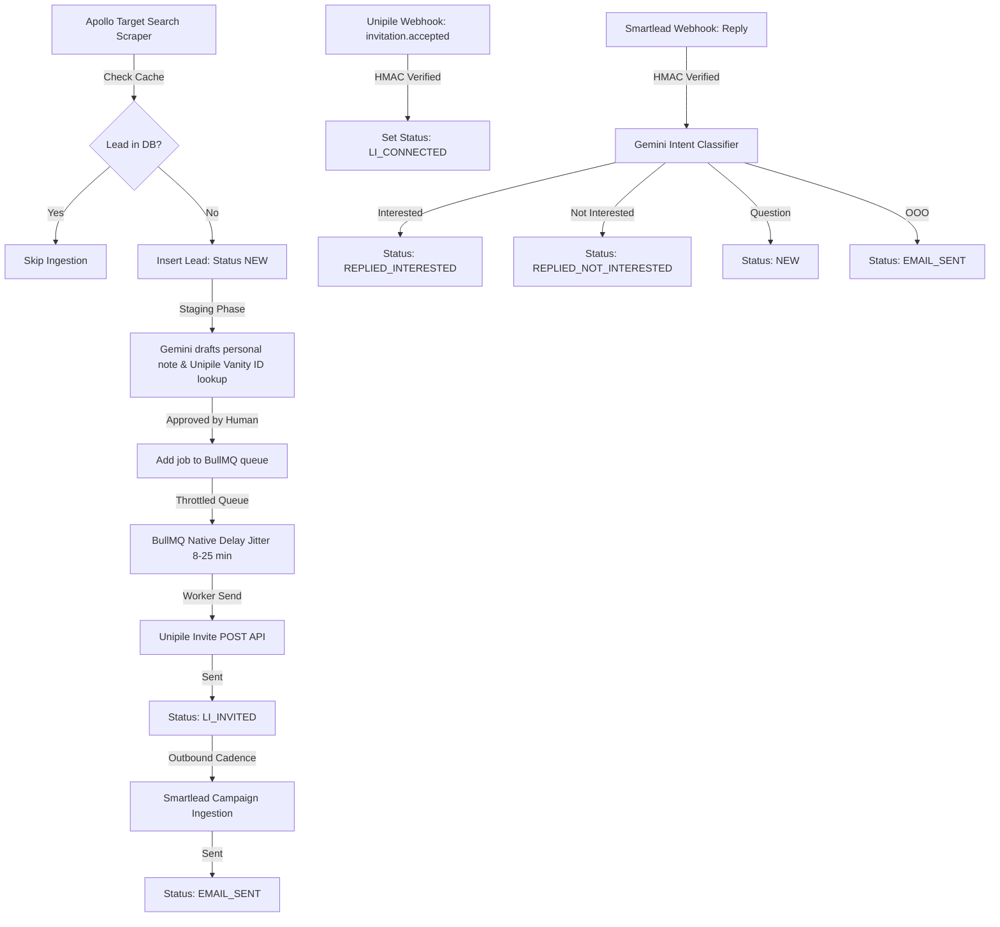

# Lions Sales Academy AI SDR Backend (POC)

This repository implements a highly secure, rate-limited multi-channel Autonomous AI SDR backend. It integrates target audience extraction (Apollo), LinkedIn invite sequences (Unipile + BullMQ), and cold email flows (Smartlead) within a centralized PostgreSQL state ledger.

---

## 1. System Architecture

The workflow consists of four core pipelines operating in parallel:



---

## 2. Directory Structure

```plaintext
lions-ai-sdr/
├── database/
│   └── migrations/
│       ├── 001_initial_schema.sql         # Base PostgreSQL enums & tables
│       ├── 002_add_unipile_id.sql         # Relational Unipile columns
│       └── 003_add_smartlead_id.sql       # Relational Smartlead columns
├── src/
│   ├── config/
│   │   ├── env.ts                         # Zod environment validation
│   │   └── database.ts                    # pg Pool database connector
│   ├── db/
│   │   └── migrate.ts                     # SQL migration runner utility
│   ├── routes/
│   │   └── webhookRoutes.ts               # Smartlead Webhook handler
│   ├── services/
│   │   ├── ai/
│   │   │   ├── observability.ts           # Langfuse tracing helpers
│   │   │   └── gemini.ts                  # Gemini wrapper & dev fallbacks
│   │   ├── data/
│   │   │   ├── apollo.ts                  # Apollo search caching layer
│   │   │   └── mockLeads.json             # ICP Target test lead profiles
│   │   ├── email/
│   │   │   └── smartlead.ts               # Smartlead campaigns & reply analyzer
│   │   ├── linkedin/
│   │   │   └── unipile.ts                 # Invite stager & Webhook handler
│   │   └── queue/
│   │       ├── outreachQueue.ts           # BullMQ queue registration
│   │       └── workers.ts                 # BullMQ delayed worker loop
│   └── app.ts                             # Express server entry point
├── scripts/
│   └── test_tracing.ts                    # E2E Integration verification script
└── docker-compose.yml                     # PostgreSQL & Redis container config
```

---

## 3. Database Schema Design

We use raw PostgreSQL DDL schemas to maintain full transactional consistency:

### Prospects (`prospects` table)
* `id` (UUID, PK): Unique lead identifier.
* `apollo_id` (VARCHAR, Unique): Apollo lead identifier.
* `first_name`, `last_name`, `email`, `linkedin_url`, `designation`, `geography`, `company_name`
* `status` (ENUM): tracks the lifecycle status (`NEW`, `LI_INVITED`, `LI_CONNECTED`, `EMAIL_SENT`, `REPLIED_INTERESTED`, `REPLIED_NOT_INTERESTED`, `CALL_ESCALATED`, `DNC`).
* `unipile_invitation_id` (VARCHAR, Indexed Unique): Webhook mapping key for LinkedIn responses.
* `smartlead_id` (VARCHAR, Indexed Unique): Webhook mapping key for Email replies.
* `metadata` (JSONB): Caches custom generated copy, resolved provider IDs, and timestamps.

### Interaction Logs (`interaction_logs` table)
* `id` (SERIAL, PK)
* `prospect_id` (UUID, FK): Links back to the prospect.
* `channel` (ENUM): `LINKEDIN`, `EMAIL`, `VOICE`.
* `direction` (ENUM): `INBOUND`, `OUTBOUND`.
* `message_content` (TEXT): Stored text content.
* `gemini_intent_tag` (VARCHAR): Classified reply sentiment category.
* `langfuse_trace_id` (VARCHAR): Trace link for monitoring and costs audit.

---

## 4. Security & Guardrails

1. **HMAC Webhook Hashing**: Inbound handlers verify the `x-unipile-signature` and `x-smartlead-signature` headers against the computed SHA256 HMAC of the request body to prevent fake status updates.
2. **Stateless delayed workers**: To avoid blocking Node event loops with `setTimeout` sleep triggers, jitter calculations (8-25 minutes in prod, 1-3 seconds in dev) are passed to Redis using BullMQ's native `{ delay: jitterMs }` parameters.
3. **Daily API Quota Bypass**: In development environments (`APP_ENV=development`), if the Gemini API throws a `RESOURCE_EXHAUSTED` (429) daily quota exception, the system automatically falls back to static test tags instead of crashing the pipeline.

---

## 5. Getting Started & Execution

### 1. Boot Container Infrastructure
Spin up PostgreSQL and Redis:
```bash
docker-compose up -d
```

### 2. Apply Migrations
Run the idempotent DDL migration scripts:
```bash
npm run migrate
```

### 3. Launch Development Server
Starts the Express server on port `3000` along with background worker listeners:
```bash
npm run dev
```

### 4. Run Integration Verification Test Suite
Executes the comprehensive E2E validation cycle verifying caches, invite staging, workers delay, webhooks updates, and AI classifications:
```bash
npm run test:integration
```
