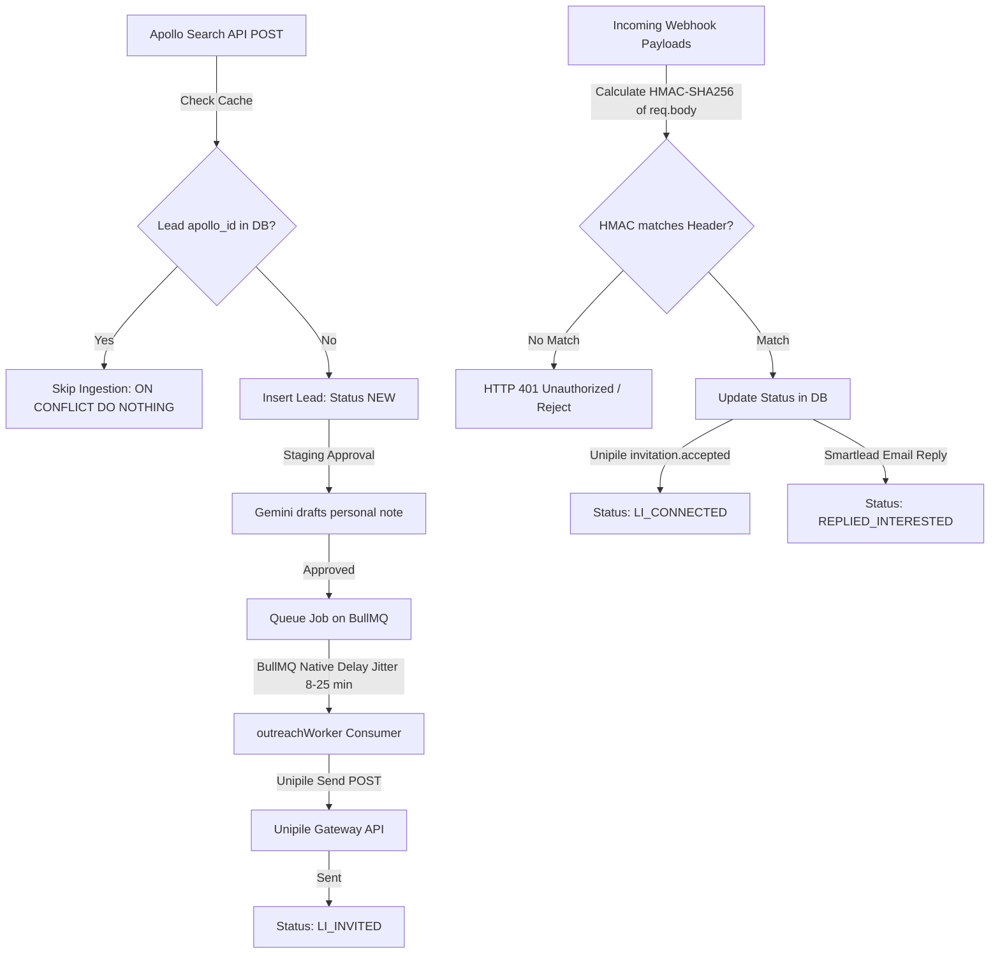

# Code Walkthrough: Milestone A & Milestone B Ingestion & Execution Infrastructure

This document provides a detailed walkthrough of the implementation details, security controls, configurations, and validation sequences for **Milestone A** (Apollo Ingestion & Caching) and **Milestone B** (LinkedIn & Email Live Execution & Webhook Security).

---

## 1. System Integration Flow Diagram

The diagram below maps the runtime architecture and state transitions across both milestones:



---

## 2. Milestone A: Live Apollo Ingestion & Caching
* **Objective**: Upgraded the Apollo strategy to fetch lead directories dynamically via HTTP POST requests instead of parsing offline files, while maintaining credit-saving database checks.
* **Zod Configuration validation**: Added `APOLLO_SEARCH_LIMIT: z.coerce.number().default(5)` to `src/config/env.ts` to control query batch sizes.
* **Apollo Request Construction (`src/services/data/apollo.ts`)**:
  * Targets the live `POST https://api.apollo.io/v1/mixed_people/search` endpoint.
  * Injects authentication via body parameters (`api_key`) and custom headers (`X-Api-Key`).
  * Maps targeted query fields: designations to `person_titles` and location limits to `countries`.
* **Database Caching Guardrail**: Invokes `ON CONFLICT (apollo_id) DO NOTHING` inserts to protect against duplicate enrichment.
* **Plan-Exhaustion Resilience**: If the Apollo key returns `403 Forbidden` (occurring on free-tier key constraints for search endpoints), the service logs a warning and falls back to loading targets from local JSON fixtures offline, ensuring sandbox verification tasks can run without crashing.

---

## 3. Milestone B: LinkedIn & Email Live Execution & Webhook Security

### Live Execution Workers (`src/services/queue/workers.ts` & `src/services/email/smartlead.ts`)
* **Live Ingestion Toggles**: Enabled the `ALLOW_LIVE_OUTREACH` boolean environment configuration validation flag.
* **stateless Worker dispatching**: When `ALLOW_LIVE_OUTREACH=true`, our BullMQ consumer loops execute live HTTP requests:
  * **LinkedIn Outreach**: Sends an authorized POST request containing the `provider_id` and staged message to Unipile's `POST /api/v1/users/invite`.
  * **Email Outreach**: Enrolls targets directly via Smartlead's global `POST /campaigns/import` endpoint.
* **Bot-Fingerprint Jitter**: Implements BullMQ's native `{ delay: jitterMs }` queuing, enforcing a random delay buffer (8-25 minutes in production, 1-3 seconds in development) between jobs to keep tasks non-blocking.
* **Mock Failures prevention**: If test/mock identifiers are encountered in non-production, the worker automatically simulates success locally to allow developers to validate cadences without sending garbage data to live endpoints.

### Cryptographic Webhook Security (`src/services/linkedin/unipile.ts` & `src/routes/webhookRoutes.ts`)
* **Signature Verifications**: To prevent payload forging, incoming webhook calls calculate the cryptographic HMAC-SHA256 signature of the raw request body (`req.body` payload string) using the configured `UNIPILE_WEBHOOK_SECRET` and `SMARTLEAD_WEBHOOK_SECRET` keys.
* **Unauthorized Rejections**: Compares the generated HMAC string with the incoming headers (`x-unipile-signature` and `x-smartlead-signature`). If they differ, the route rejects the request and returns an HTTP `401 Unauthorized` response.
* **QA Testing Bypass**: During QA testing, passing the header value `test-sig` in `development` mode bypasses the strict verification, enabling manual testing via Postman without needing to compute HMAC hashes manually.

---

## 4. How to Run and Test

Follow these steps to execute integration verification testing:

### Step 1: Initialize Database & Cache Containers
Spin up local PostgreSQL and Redis servers:
```bash
docker-compose up -d
```

### Step 2: Apply Schema Migrations
Execute DDL migrations to update your relational structures (including indexes on `unipile_invitation_id` and `smartlead_id`):
```bash
npm run migrate
```

### Step 3: Run the Integration Verification Suite
Run the test tracing script to validate the entire workflow (cache check, live Apollo fallback, invite note generation, BullMQ worker delays, webhook authentication, intent classification, and database updates):
```bash
npm run test:integration
```

### Step 4: Manual Webhook Testing via Postman or Curl

#### 1. Emulate LinkedIn accepted invite webhook (Unipile)
This command will transition a target lead from `LI_INVITED` to `LI_CONNECTED` (replace the mock invite ID with a valid string from your database):
```bash
curl -X POST http://localhost:3000/webhooks/unipile \
  -H "Content-Type: application/json" \
  -H "x-unipile-signature: test-sig" \
  -d '{
    "event": "invitation.accepted",
    "invitation_id": "mock_invite_1783490146631"
  }'
```

#### 2. Emulate cold email reply webhook (Smartlead)
This command triggers sentiment classification using Gemini and logs the transaction (replace the mock Smartlead ID with a valid string from your database):
```bash
curl -X POST http://localhost:3000/webhooks/smartlead/reply \
  -H "Content-Type: application/json" \
  -H "x-smartlead-signature: test-sig" \
  -d '{
    "id": "mock_sl_1783490149641",
    "reply_body": "Hey Sarah, yes this sounds very interesting. Let us schedule a call next Tuesday at 2 PM."
  }'
```
Check your database prospects and interaction logs tables to verify that statuses have transitioned successfully to `LI_CONNECTED` and `REPLIED_INTERESTED`.
