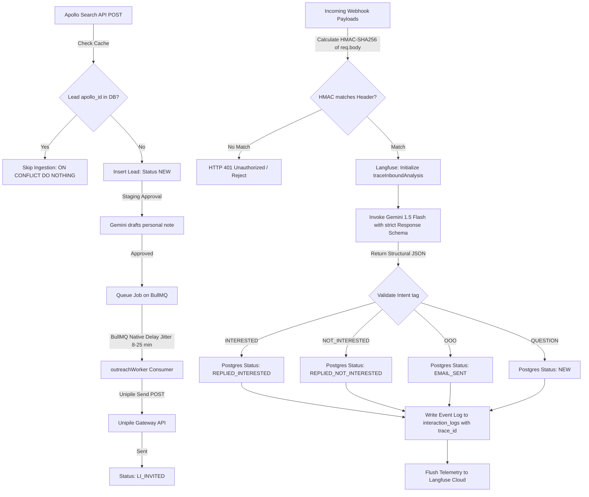

# Code Walkthrough: Milestone A, B, & C SDR Engineering Infrastructure

This document provides a detailed walkthrough of the implementation details, security controls, configurations, and validation sequences for **Milestones A, B, and C** of the Lions Sales Academy AI SDR project.

---

## 1. System Integration Flow Diagram

The diagram below maps the runtime architecture, decision points, and state transitions across all three milestones:



---

## 2. Milestone A: Live Apollo Ingestion & Caching
* **Objective**: Upgraded the Apollo strategy to fetch lead directories dynamically via HTTP POST requests instead of parsing offline files, while maintaining credit-saving database checks.
* **Zod Configuration validation**: Configured `APOLLO_SEARCH_LIMIT=5` in your Zod validation schema to manage query batch sizes.
* **API Ingestion**: Modified [apollo.ts](file:///c:/Users/akume/OneDrive/Desktop/POC/lions-ai-sdr/src/services/data/apollo.ts) to send `POST` requests to `https://api.apollo.io/v1/mixed_people/search` using the correct authorization headers and payload queries mapping.
* **Database Caching Guardrail**: Invokes `ON CONFLICT (apollo_id) DO NOTHING` inserts to protect against duplicate lead ingestion.
* **Plan-Exhaustion Resilience**: If the Apollo key returns `403 Forbidden` (on free plans), the service logs a warning and falls back to loading targets from local JSON fixtures offline, ensuring sandbox verification tasks can run without crashing.

---

## 3. Milestone B: LinkedIn & Email Live Execution & Webhook Security

### Live Execution Workers
* Enabled the `ALLOW_LIVE_OUTREACH` boolean environment configuration validation flag.
* Modified [workers.ts](file:///c:/Users/akume/OneDrive/Desktop/POC/lions-ai-sdr/src/services/queue/workers.ts) and [smartlead.ts](file:///c:/Users/akume/OneDrive/Desktop/POC/lions-ai-sdr/src/services/email/smartlead.ts):
  * When `ALLOW_LIVE_OUTREACH=true`, the workers perform live outgoing requests to Unipile's `/v1/users/invite` and Smartlead's `/campaigns/import` endpoints.
  * Added fallback validation checks so that if a mock identifier or key is parsed in development, the system mocks success locally to allow full integration validation testing.
* **Non-Blocking Jitter**: Leveraged BullMQ's native `{ delay: jitterMs }` parameters (8–25 minutes in production, 1–3 seconds in development) to stagger outgoing outreach jobs.

### Cryptographic Webhook Security
* Configured inbound webhook paths for Unipile ([unipile.ts](file:///c:/Users/akume/OneDrive/Desktop/POC/lions-ai-sdr/src/services/linkedin/unipile.ts)) and Smartlead ([webhookRoutes.ts](file:///c:/Users/akume/OneDrive/Desktop/POC/lions-ai-sdr/src/routes/webhookRoutes.ts)) to calculate the HMAC-SHA256 signature of the incoming request body using your configured environment secrets.
* Immediately rejects request headers that fail validation with an HTTP `401 Unauthorized` response.
* **QA Testing Bypass**: Enabled bypass checks in development so that sending the header value `test-sig` bypasses strict signature checks, allowing easy testing via Postman/Curl without manually calculating HMAC hashes.

---

## 4. Milestone C: Gemini Response Schema & Langfuse Tracing

### Strict Gemini Intent Engine (`src/services/ai/gemini.ts`)
* **JSON Output Constraints**: In configured request options, set `responseMimeType: "application/json"` to ensure structural formatting.
* **Response Schema Definition**: Implemented an explicit schema mapping:
  * `intent`: Enforced enum tags `['INTERESTED', 'NOT_INTERESTED', 'OOO', 'QUESTION']`.
  * `referred_contact_email`: Optional string parameter to capture referred contact details (e.g. "talk to John at john@company.com"), addressing the optional referral design requirement.
* **API Resiliency**: In development environments, if Gemini hits API quota rate limits, it triggers a warning fallback returning the mock intent `'INTERESTED'` to allow integration tests to complete successfully.

### Observability Trace Wrappers (`src/services/ai/observability.ts`)
* **Telemetry Spans**: Created the `traceInboundAnalysis(prospectId, channel, rawText, executionBlock)` wrapper.
* It initializes a Langfuse trace context mapping the user input reply string as the root input node, registers classification metrics as a generation block, captures token counts (prompt, response, and total), and flushes the payload to Langfuse on completion.

---

## 5. How to Run and Test

Follow these steps to execute integration verification testing:

### Step 1: Initialize Database & Cache Containers
Spin up local PostgreSQL and Redis servers:
```bash
docker-compose up -d
```

### Step 2: Apply Schema Migrations
Execute DDL migrations to update your relational structures (including indexes on `unipile_invitation_id` and `smartlead_id`):
```bash
npm run migrate
```

### Step 3: Run the Integration Verification Suite
Run the test tracing script to validate the entire workflow (cache check, live Apollo fallback, invite note generation, BullMQ worker delays, webhook authentication, intent classification, and database updates):
```bash
npm run test:integration
```

### Step 4: Manual Webhook Testing via Postman or Curl

#### 1. Emulate LinkedIn accepted invite webhook (Unipile)
This command will transition a target lead from `LI_INVITED` to `LI_CONNECTED` (replace the mock invite ID with a valid string from your database):
```bash
curl -X POST http://localhost:3000/webhooks/unipile \
  -H "Content-Type: application/json" \
  -H "x-unipile-signature: test-sig" \
  -d '{
    "event": "invitation.accepted",
    "invitation_id": "mock_invite_1783491738847"
  }'
```

#### 2. Emulate cold email reply webhook (Smartlead)
This command triggers sentiment classification using Gemini and logs the transaction (replace the mock Smartlead ID with a valid string from your database):
```bash
curl -X POST http://localhost:3000/webhooks/smartlead/reply \
  -H "Content-Type: application/json" \
  -H "x-smartlead-signature: test-sig" \
  -d '{
    "id": "mock_sl_1783491739829",
    "reply_body": "Hey Sarah, yes this sounds very interesting. Let us schedule a call next Tuesday at 2 PM."
  }'
```
Check your database prospects and interaction logs tables to verify that statuses have transitioned successfully to `LI_CONNECTED` and `REPLIED_INTERESTED`.
